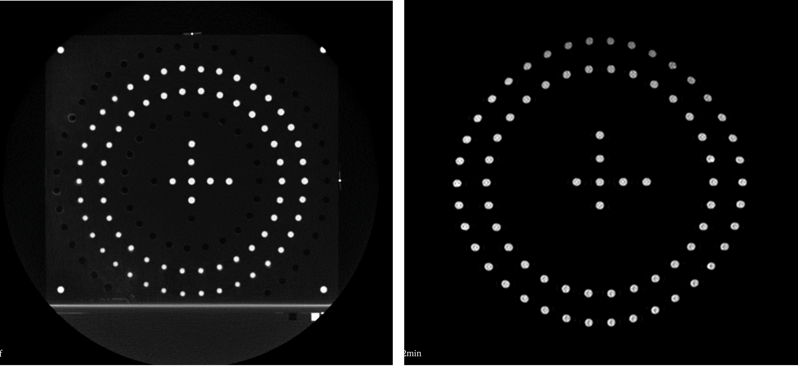
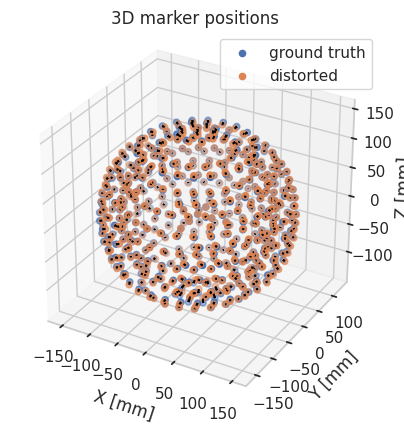
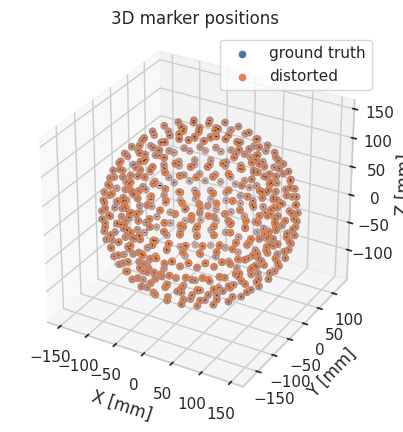
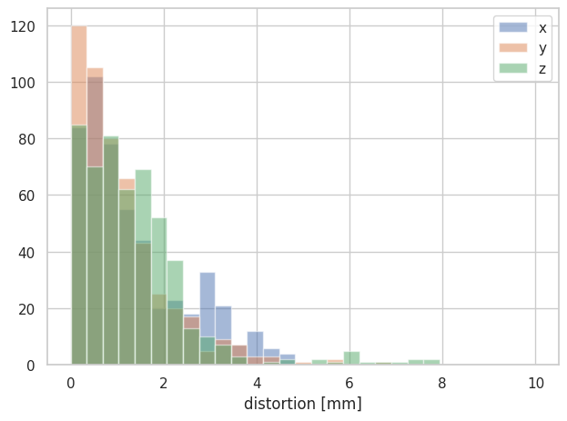
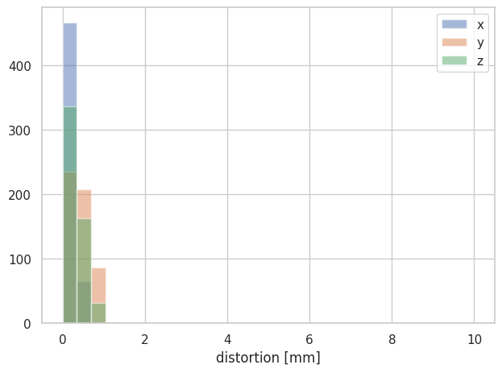
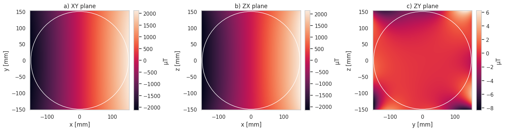

# Analysis of Elekta Unity MRI-Linac using Image-X MRI distortion phantom

This notebook demonstrates the use of the Sydney University phantom [described here](https://image-x-institute.github.io/mri_distortion_toolkit/phantom_notes.html) with an Elekta MRI-Unity. All analysed data is available as a zenodo dataset [here](https://zenodo.org/records/10685865). Documentation for the `mri_distortion_toolkit` is [here](https://image-x-institute.github.io/mri_distortion_toolkit/). This phantom was designed for use on the Australian MRI-Linac, and as such has a relatively small field of view (covering a 150 mm radius). However, this writeup demonstrates that the basic phantom design easily extends itself easily to different scanners. The jupyter notebooks which this write is based on are available [here](https://github.com/bwheelz36/genesis_analysis).

## Image Acquisition

The phantoms were imaged on an Elekta Unity system using a 3D spin echo sequence with a bandwidth of 740 Hz. Images were acquired both with and without vendor distortion correction. In addition, the phantom was scanned on a Siemens Somatom Definition AS CT scanner to provide the marker ground truth position.

The acquired images are shown below; the CT is on the left and the MR is on the right.



## Marker Extraction


```python
from pathlib import Path
from mri_distortion_toolkit.MarkerAnalysis import MarkerVolume, MatchedMarkerVolumes
from mri_distortion_toolkit.utilities import plot_distortion_xyz_hist
import numpy as np

# path to data"
ct_data_loc = r"/home/brendan/Dropbox (Sydney Uni)/Projects/OpenDistortionPhantom/genesis_data/GOAM_CT/2022-08__Studies/ImageX^GOAM_ZZZIMAGEX_CT_2022-08-31_170444_RT^01.Pelvis.Customized.(Adult)_Pelvis..2.0..B31f_n178__00000"

# extract CT data (nb: will take a few minutes)
ct_volume = MarkerVolume(ct_data_loc, ImExtension='dcm', n_markers_expected=531, gaussian_image_filter_sd=0)
```

Now extract the MR data:

```python
# path to data:
mr_data_loc_with_DC = Path(r"/home/brendan/Dropbox (Sydney Uni)/Projects/OpenDistortionPhantom/genesis_data/GOAM_MRI/2022-08__Studies/GOAM^ImageX_ZZZIMAGEX_MR_2022-08-31_172341_._T2.3D.Tra.2min_n301__00002")
mr_data_loc_no_DC = Path(r"/home/brendan/Dropbox (Sydney Uni)/Projects/OpenDistortionPhantom/genesis_data/GOAM_MRI/2022-08__Studies/GOAM^ImageX_ZZZIMAGEX_MR_2022-08-31_172341_._T2.3D.Tra.2min_n301__00001")

# extract MR markers, without distortion correction  (nb: will take a few minutes)
mri_volume_no_DC = MarkerVolume(mr_data_loc_no_DC, n_markers_expected=531, r_max=170)
mri_volume_with_DC= MarkerVolume(mr_data_loc_with_DC, r_max=None, n_markers_expected=531)
```

On my PC, marker extraction took 63 seconds for the CT data, and 94 seconds for each of the MRI data. 

For one of the MRI datasets, the code also warned that not all expected markers could be extracted:

> [MarkerAnalysis.py: line 150  WARNING] For data GOAM^ImageX_ZZZIMAGEX_MR_2022-08-31_172341_._T2.3D.Tra.2min_n301__00001
> You entered that you expected to find 531, but actually found 507.

This could probably be resolved by fine tuning the filtering parameters, but it's also not necessary - as long as the MR data has **less** markers than the ground truth, the code will proceed without error, simply discarding ground truth markers for which it can not find an equivalent MR marker. So as long as the code finds the majority of the markers, we should be able proceed.


## Marker Matching

At this point, we have extracted the markers from all three image series. The next step is to match the distorted marker positions to the ground truth marker positions. We use the `MatchedMarkerVolumes` class to do this:


```python
from mri_distortion_toolkit.MarkerAnalysis import MarkerVolume, MatchedMarkerVolumes
from mri_distortion_toolkit.utilities import plot_distortion_xyz_hist
import numpy as np

# match markers:
no_DC_match = MatchedMarkerVolumes(ct_volume, mri_volume_no_DC, n_refernce_markers=7)
with_DC_match = MatchedMarkerVolumes(ct_volume, mri_volume_with_DC, n_refernce_markers=7)
```

Note that we specified 7 reference markers. The code will use the 7 most central markers to ensure the images are aligned before performing any matching - this step fixes any issues that may arise from different coordinate systems in use between the CT and MR scanners.
In this case, the marker matching proceeds without warning, indicating that it has probably been succesful. However, it is always good to check visually. Plot the marker positions:

```python
no_DC_match.plot_3D_markers()
```



    
and with distortion correction:

```python
with_DC_match.plot_3D_markers()
```



In general, you can see that the Philipps distortion correction is excellent. Even with no distortion correction, the distortion in this FOV is quite small. For a more quantitative view, we can plot a histogram:

```python
plot_distortion_xyz_hist(no_DC_match)
```



```python
plot_distortion_xyz_hist(with_DC_match)
```



## spherical harmonics

Based on these (distorted) marker positions, we can calculate the gradient fields, and characterize these in terms of spherical harmonics. For this to really be interesting, we would need a phantom covering a bigger FOV, but nevertheless:

```python
from mri_distortion_toolkit.FieldCalculation import ConvertMatchedMarkersToBz
from mri_distortion_toolkit import calculate_harmonics

Bz_field = ConvertMatchedMarkersToBz(no_DC_match.MatchedCentroids, mri_volume_no_DC.dicom_data)
gradient_strength = np.array(mri_volume_no_DC.dicom_data['gradient_strength'])
normalisation_factor = [1 / gradient_strength[0], 1 / gradient_strength[1], 1 / gradient_strength[2],
                        1]  # this normalised gradient harmonics to 1mT/m
G_x_Harmonics, G_y_Harmonics, G_z_Harmonics, B0_Harmonics = calculate_harmonics(Bz_field.MagneticFields, n_order=8, scale=normalisation_factor)
```
Which outputs (among other things):

> Residual pk-pk:       1.219e+01 μT ( 0.3%)
> Residual pk-pk:       2.625e+01 μT ( 0.7%)
> Residual pk-pk:       3.752e+01 μT ( 1.2%)


The "residual pk-pk" reporter here is the peak-peak of the residual=(initial - reconstructed) field. The small residual error in all cases is what we are looking for, indicating the spherical harmonics are a good fit to the data.

Now we have these harmonics, we can make some nice plots and print the dominant harmonics:


```python
G_x_Harmonics.plot_cut_planes()
```


Note that this varies in X as expected; in the ZY plane the field is close to 0. These plots are pretty but not actually all that informative. For me a more interesting metric is the dominant harmonics:


```python
G_x_Harmonics.print_key_harmonics()
```

> Only displaying values >=  1% of the peak harmonic.
> Values are in pk=pk [μT]
> A_1_1   -4.1594e+03f
> A_3_1    1.1283e+02f
> A_3_3   -6.5344e+01f
> A_5_1    9.3329e+01f


You'd have to be a real nerd to know it, but the dominant harmonic for the X gradient should be A_1_1, which it is. Furthermore, through arguments about symetry (again you'd have to be a real nerd) I'd expect the other dominant harmonics to be A_3_1, A_5_1, and maybe A_7_1. This is also what we see; in addition to these 'symmetric' terms, we have a reasonable contribution from the A_3_3 term.

If we'd been able to apply the reverse gradient technique, we'd also be able to pull out an estimate of the B0 field, however on this scanner we have not figured out how to do this (if you know, [please contribute to our open docs!](https://image-x-institute.github.io/mri_distortion_toolkit/phantom_imaging.html#separation-of-b0-gradient-distortion-effects))

## Reporting and distortion correction

We won't show it here in the interests of conciseness, but we are now in a position where we could generate html reports or do distortion correction. If you are interested in this please see [here](https://image-x-institute.github.io/mri_distortion_toolkit/index.html#).
