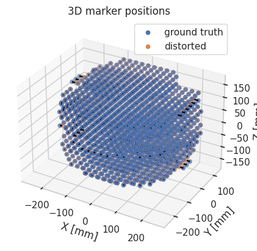
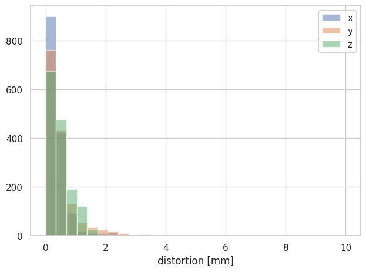
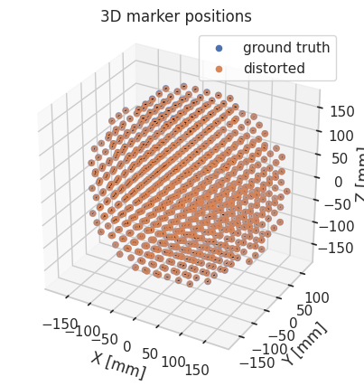
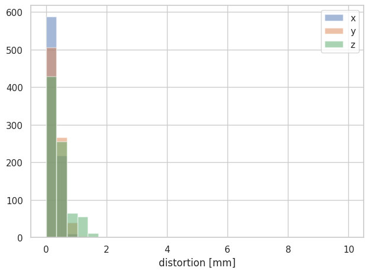
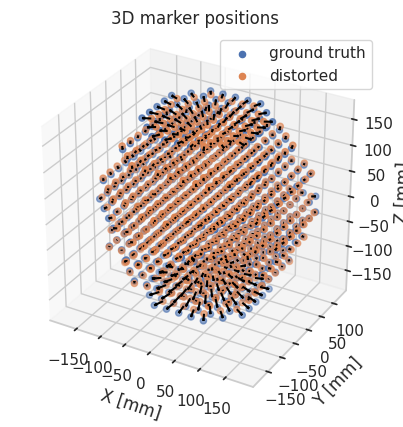
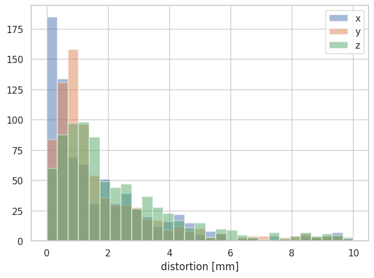

# Analysis of Elekta Unity MRI-Linac using Phillips distortion phantom
This notebook demonstrates the use of the Phillips Distortion Phantom with an Elekta MRI-Unity. All analysed data is available [here](https://zenodo.org/records/10685865). Documentation for the `mri_distortion_toolkit` is [here](https://image-x-institute.github.io/mri_distortion_toolkit/).

The Phillips Phantom appears quite similar to the [Image X phantom](https://image-x-institute.github.io/mri_distortion_toolkit/phantom_notes.html), consisting of parallel planes with embedded markers of some signal generating substrate. Compared to the sydney university phantom, it is much heavier, much more rigid, and has a much larger field of view. It looks like the below image (image from [Roberts et. al 2021](https://www.researchgate.net/publication/349288916_Machine_QA_for_the_Elekta_Unity_system_A_Report_from_the_Elekta_MR-Linac_consortium)).

This notebook demonstrate that the [mri_distortion_toolkit](https://github.com/Image-X-Institute/mri_distortion_toolkit) software can be effective even on phantoms it was not designed for or previously tested with.


## Phantom Imaging

The phantoms were imaged on an Elekta Unity system using a 3D spin echo sequence with a bandwidth of 740 Hz. Images were acquired both with and without vendor distortion correction. In addition, the phantom was scanned on a Siemens Somatom Definition AS CT scanner to provide the marker ground truth position.

The acquired images are shown below; the CT is on the left and the MR is on the right.


Note the poor marker visibility in the CT image, along with the multiple source of contrast which look like they may be markers, but are not. We were unable to process this CT data, necessitating the use of artificial ground truth data as described below.

## Marker Extraction

One challenge with this phantom is that the markers don't have unique contrast on the CT. We were unable to easily extract the marker positions from the CT image, so instead we create an 'artificial' ground truth based on the known marker positions. The code do this is located [here](https://github.com/bwheelz36/genesis_analysis/blob/main/python_codes/philips_phantom.py)


```python
import sys
import os
from pathlib import Path
this_file_loc = Path(os.path.abspath(''))
sys.path.insert(0, str(this_file_loc.parent))
from mri_distortion_toolkit.MarkerAnalysis import MarkerVolume,MatchedMarkerVolumes
from python_codes.philips_phantom import philips_phantom
from mri_distortion_toolkit.utilities import plot_distortion_xyz_hist

# Distorted centroids corrected (will take around 10 minutes - these are big images!)
mr_data_loc_with_DC = Path("/home/brendan/Dropbox (Sydney Uni)/Projects/OpenDistortionPhantom/genesis_data/PhilipPhantom_MRI/2022-08__Studies/GOAM^ImageX_ZZZIMAGEX_MR_2022-08-31_172341_._T2.3D.Tra.2min_n401__00002")
mri_volume_with_DC = MarkerVolume(mr_data_loc_with_DC)
```

```python
# Distorted Centroids uncorrected (will take a few minutes)
mr_data_loc_no_DC = Path("/home/brendan/Dropbox (Sydney Uni)/Projects/OpenDistortionPhantom/genesis_data/PhilipPhantom_MRI/2022-08__Studies/GOAM^ImageX_ZZZIMAGEX_MR_2022-08-31_172341_._T2.3D.Tra.2min_n401__00000")
mri_volume_no_DC = MarkerVolume(mr_data_loc_no_DC)
# mri_volume_no_DC.plot_3D_markers(title='MRI uncorrected')
```

```python
# Undistorted centroids (artifically created)
(x, y, z) = philips_phantom.get_alignment_coords(mri_volume_with_DC)
philips_centroids = philips_phantom.generate_centroids(x, y, z)
philips_gt = MarkerVolume(philips_centroids)
```

## Marker Matching


```python
# # Match markers corrected
corrected = MatchedMarkerVolumes(philips_gt, mri_volume_with_DC)

corrected.plot_3D_markers()
plot_distortion_xyz_hist(corrected)
```

   





Note that these 'markers' on the edge are actually the result of phase wrapping artefacts. So the largest distortion we are seeing here are not real. We may be able to get rid of these artefacts by using a larger FOV, but for now we will get rid of them by just clipping the input data:


```python
mri_volume_with_DC.MarkerCentroids = mri_volume_with_DC.MarkerCentroids[mri_volume_with_DC.MarkerCentroids['r'] < 190]
corrected = MatchedMarkerVolumes(philips_gt, mri_volume_with_DC)
corrected.plot_3D_markers()
plot_distortion_xyz_hist(corrected)
```


​    
<!-- 
​    


 -->
    


OK, once we've clipped the data to a total DSV of 380 mm (still quite a large FOV) all distortion is comfortably within 2 mm. This is quite impressive! 

Let's take a look at the result without distortion correction. Again, we will first filter the markers by radius because otherwise we have phase wrap and marker overlap and it becomes impossible to perform a 1:1 match.


```python
# trim uncorrected data:
mri_volume_no_DC.MarkerCentroids = mri_volume_no_DC.MarkerCentroids[mri_volume_no_DC.MarkerCentroids['r'] < 190]
# match  uncorrected data:
uncorrected = MatchedMarkerVolumes(philips_gt, mri_volume_no_DC)
uncorrected.plot_3D_markers()
plot_distortion_xyz_hist(uncorrected)

```



    


 -->
    


We can also print ourselves out a little report:


```python
print(f'Median distortion: {uncorrected.MatchedCentroids.match_distance.median(): 1.1f} mm, 'f'Max distortion: {uncorrected.MatchedCentroids.match_distance.max(): 1.1f} mm')
```

    Median distortion:  3.2 mm, Max distortion:  18.1 mm


So with no distortion correction, a maximum distortion of 18.1 over 380 mm with no distortion correction - honestly it's actually still quite impressive over that FOV!

## Reporting - harmonic driven

The problem with the marker data is that it's relatively sparse, especially when it comes to generating pretty plots. Instead we can use harmonics to reconstruct data wherever we want. Of course, the two cases **should** produce very similar results! 


```python
from mri_distortion_toolkit.FieldCalculation import ConvertMatchedMarkersToBz
from mri_distortion_toolkit import calculate_harmonics
import numpy as np
from mri_distortion_toolkit.Reports import MRI_QA_Reporter
from mri_distortion_toolkit.Reports import Elekta_Distortion_tests

Bz = ConvertMatchedMarkersToBz(corrected.MatchedCentroids, mri_volume_no_DC.dicom_data)
gradient_strength = np.array(mri_volume_no_DC.dicom_data['gradient_strength'])
normalisation_factor = [1 / gradient_strength[0], 1 / gradient_strength[1], 1 / gradient_strength[2], 1]  # this normalised gradient harmonics to 1mT/m
G_x_Harmonics, G_y_Harmonics, G_z_Harmonics, B0_Harmonics = calculate_harmonics(Bz.MagneticFields, n_order=5,                            scale=normalisation_factor)
```

    Residual pk-pk:       1.005e+01 μT ( 0.3%)
    Residual pk-pk:       8.878e+00 μT ( 0.3%)T
    Residual pk-pk:       1.822e+01 μT ( 0.5%)


Note the very low fit errors in each case; that is what we want to see


```python
report_harmonics = MRI_QA_Reporter(gradient_harmonics=[G_x_Harmonics.harmonics,
                                                       G_y_Harmonics.harmonics,
                                                       G_z_Harmonics.harmonics],
                                     r_outer=190,
                                     dicom_data=mri_volume_no_DC.dicom_data,
                                     tests_to_run=Elekta_Distortion_tests)
report_harmonics.write_html_report()
```

    The report has been compiled and can be found at /home/brendan/Documents/MR_QA_Reports

The report is in html format and saved to the local computer. For the purposes of this report, we have copied it directly below - note that if you use the html version the figures are also interactive.


<!doctype html>
<html>
<head>
<meta charset='UTF-8'><meta name='viewport' content='width=device-width initial-scale=1'>
<title>MR_report:</title>
</head>
<link rel="stylesheet" type="text/css" rel="noopener" target="_blank" href=themes/d42ker-github.css>
<body><h1 id='mr-qa-report'>MR QA report 21_02_2024</h1>
<h2 id='acquisition_data'>Acquisition Data</h2>
      <table>
         <TR>
            <TD class="c1">bandwidth</TD>
            <TD class="c2">570.0</TD>
         </TR>
         <TR>
            <TD class="c1">pixel spacing</TD>
            <TD class="c2">[0.78125, 0.9999999999999875, 0.78125]</TD>
         </TR>
         <TR>
            <TD class="c1">magnetic field strength</TD>
            <TD class="c2">1.5</TD>
         </TR>
         <TR>
            <TD class="c1">imaging frequency</TD>
            <TD class="c2">63.868702</TD>
         </TR>
         <TR>
            <TD class="c1">acquisition date</TD>
            <TD class="c2">31_August_2022</TD>
         </TR>
         <TR>
            <TD class="c1">manufacturer</TD>
            <TD class="c2">Philips</TD>
         </TR>
         <TR>
            <TD class="c1">sequence name</TD>
            <TD class="c2">SE</TD>
         </TR>
         <TR>
            <TD class="c1">freq encode direction</TD>
            <TD class="c2">z</TD>
         </TR>
      </table>

<h2 id='tests'>Tests from: Elekta_Distortion_tests</h2>
<table>
<TD class="c1"><strong>Test Name</strong></TD>
<TD class="c2"><strong>Result</strong></TD>
<TR>
   <TD class="c1">distortion less than 1 mm within r 100 mm</TD>
   <TD class="c2"><span style='color:green'>Pass</span></TD>
</TR>
<TR>
   <TD class="c1">distortion less than 2 mm within r 150 mm</TD>
   <TD class="c2"><span style='color:green'>Pass</span></TD>
</TR>
<TR>
   <TD class="c1">distortion less than 4 mm within r 200 mm</TD>
   <TD class="c2"><span style='color:green'>Pass</span></TD>
</TR>
</table>


